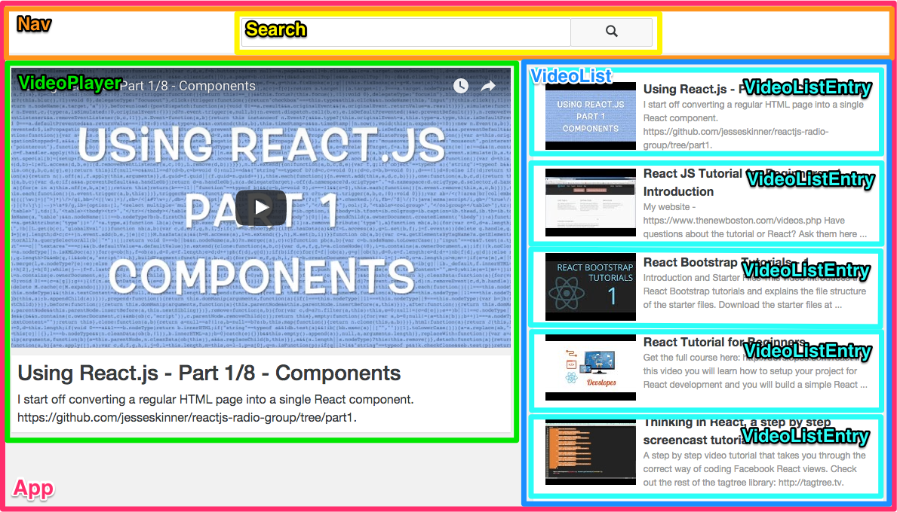

# Recast.ly

This assignment continues your journey exploring rich client-side applications. In this sprint, you'll build a video player with *React* using features in the latest finalized specification of JavaScript,ES6.

A designer friend of yours has been kind enough to give you the skeleton this application. It has all the needed styling and React components, but only renders dummy content. Your job is to bring this application to life by hooking it up with data from the [YouTube Data API](https://developers.google.com/youtube/v3/?hl=en). After completing the Bare Minimum Requirements, you'll be able to live-search, display, and play any video from YouTube.

## High Level Goals of this Sprint

* Understand the importance, and experience the benefits of client side libraries by way of building with React
* Learn how to think about web apps as components
* Learn popular ES6 features and practice using them
* Gain more exposure interacting with a REST API (in this case, the YouTube Data API)
* Gain some experience with larger codebase, containing many modules accross a variety of files

## Thinking in Components

A front-end application built with React is built entirely out of React components (frequently referred to just as components). Components can contain other components, but each component should be responsible for doing only one thing. This mimics best practices for creating functions, objects, and even programs. Making decisions about what components to create and how to organize them is somewhat arbitrary. Through experience and error you will develop more well-formed opinions, and making these kinds of decisions will become easier.

Functioning, but non-interacting versions of the required components for this application are already built. Each component lives in its own file inside of the `client/components/` directory. During this sprint you will be transforming these components to interact with each other and the YouTube Data API. Here's how they are organized:

* `App` - The top level container for the entire application. This is the component that will be rendered to the DOM
* `Nav` - A container component for the top navigation bar
* `Search` - Responsible for knowing and communicating information about the search input field
* `VideoPlayer` - Responsible for playing a single video and displaying information about it
* `VideoList` - A container component responsible for populating video list entry components
* `VideoListEntry` - A component that shows a thumbnail view for a single video. When the title of this video is clicked, that video will be played in the `VideoPlayer` component

## ES6 Transpiler

For this sprint, we'll use a tool called a *transpiler* to access more ES6 features than available behind the experimental flag in Chrome. A transpiler is a tool that will convert ES6 code into ES5, which is the current version implemented in all major JavaScript environments. This sprint includes the [Babel](http://babeljs.io/) transpiler, so that you can use any [supported ES6 features](http://babeljs.io/docs/learn-es2015/).

Babel is included as the first `script` tag in `index.html`. Loading Babel first lets us load our other scripts with a different `type` attribute. Traditionally, you would load a script tag with `` but if you set `type=text/babel`, Babel will transpile its code on the fly.

**One important gotcha when loading scripts with Babel:** Part of the ES6 spec says that every file is it's own module, and no code can be indirectly shared between two files. Babel implements this by wrapping every file it loads in an IIFE. This means that free floating `var` declarations that you would expect to be available in the global scope will not exist there unless you explicitly define them on the `window` object.

## Project set up

- [ ] Install dependencies with `bower install`
- [ ] Notice that dependencies are installed to the `client/lib` folder, as defined in the `.bowerrc` file

In order for Babel to load ES6 files correctly, they must be sent from a server not just opened from the file system. We're going to install a helper library, `live-server` to make this easy. We'll be covering servers in extensive detail next week. For now you can just run this command and ignore the complexity of what it means or how it works.

- [ ] Install the `live-server` binary onto your computer with `npm install -g live-server`
- [ ] Start the Recast.ly app by running `live-server client/` in the root directory of this repo

Your browser should pop open to `index.html`. One cool feature of `live-server` is that it automatically refreshes when you save a change to your source code. This will make development much less tedious.

## Bare Minimum Requirements

- [ ] Render the `App` component to the DOM and explore the codebase to get an understanding of each component's responsibility
- [ ] Read [this guide](https://facebook.github.io/react/docs/thinking-in-react.html) to learn more about thinking in components
- [ ] **Use ES6**. There are [a lot of new features](https://ponyfoo.com/articles/es6) in ES6. A few play very nicely with React. Insist on using them throughout this sprint:

* [Classes](https://developer.mozilla.org/en-US/docs/Web/JavaScript/Reference/Classes)
* [Arrow function expressions](https://developer.mozilla.org/en-US/docs/Web/JavaScript/Reference/Functions/Arrow_functions), especially to exploit its quality of binding `this` to the lexical scope
* [Shorthand object property and method syntax](https://developer.mozilla.org/en-US/docs/Web/JavaScript/Reference/Operators/Object_initializer)
* [Desctucturing](https://developer.mozilla.org/en-US/docs/Web/JavaScript/Reference/Operators/Destructuring_assignment)

### Create a dynamic Video List component

When building out front-end applications, it can be productive to temporarily ignore the complexity of working with real data, and mock out "fake" data instead. *Functional React components* make this easy because they render the same with "real" data from a live API or "fake" data from a file.

You're going to use the sample data in `data/exampleVideoData.js` to build out the functional `VideoList` and `VideoListEntry` components.

- [ ] Include `data/exampleVideoData.js` in an appropriate place in `index.html` so it can be used by your React components
- [ ] Pass `exampleVideoData` as a prop to `VideoList` and dynamically render one `VideoListEntry` component for each video object in `exampleVideoData`
- [ ] Refactor the 3 hard-coded values inside the `VideoListEntry` component to dynamically render them based on the video object it received as a prop

When it's all set up, you should see the titles, thumbnails, and descriptions of some React Tutorials on the page. Don't yet concern yourself with the fact that clicking on them does not do anything, you'll be adding functionality for this soon. Also, if you notice a *Warning* in the console about a "unique 'key' prop", know that this has to do with React's performance, but for now, you can and should ignore it.

### Create a dynamic Video Player component

Videos are played by passing a source url to the `iframe` tag inside the `VideoPlayer` component. The video associated with the id included after `https://www.youtube.com/embed/` will get played. Because this is also a functional component, we can build it out with our example data.

- [ ] Pass a single video from `exampleVideoData` as a prop to `VideoPlayer`
- [ ] Update `VideoPlayer` to play the video it is passed and display its title and descriptions

### Hook together the Video List and Video Player components

Now it's time to make the functional components interact. In React, sibling components can not directly access each other, so they need the help of a parent component to manage communication between them. In this case the parent component for the sibling components `VideoList` and `VideoPlayer` is `App`.

Up until now you have been working with functional components which are great when all you need to do is receive props and render JSX. When your components need to do more than this, you will need to use *class components*.

- [ ] If you haven't already, complete the [6ees6ees6ees mini sprint](https://bookstrap.hackreactor.com/curriculum/6ees6ees6ees)
- [ ] Refactor `App` into a class component using ES6 classes
- [ ] Initialize the `state` of `App` to keep track of all the videos in the video list and the current video in the player. Pass this `state` down as props to its children components. Continue to use the example data.
- [ ] Make it so that when the title of a `VideoListEntry` is clicked, that video is displayed in the player. **Do not** add `state` to any of the functional components. Remember:
  * When `setState` is called, the component whose state was updated re-renders, along with any of its children components
  * You can pass functions as props

### Set up interactions with the YouTube API

You'll need a developer key in order to access videos from the YouTube Data API. This is common practice with third party APIs because they want to keep track of who is accessing their data, enforce rate limits, and even sometimes make money. Access to the YouTube API is free, all you need is a Google Account.

- [ ] Go to Google's [API Library](https://console.developers.google.com/project/_/apiui/apis/library)
- [ ] If prompted, select a project or create a new one. It doesn't matter what you name a new project 
- [ ] In the list of APIs, select on the `YouTube Data API v3`.
- [ ] Click `Enable API`
- [ ] Navigate to the `Credentials` page and create a new `API Key`
- [ ] Select `Browser key`, give it any name, leave the optional field blank, and click `Create`.
- [ ] Copy your new API key
- [ ] Rename `config/youtube.example.js` to `config/youtube.js`. This config file is ignored and should *never* be checked into version control. Confirm this is so in `.gitignore`
- [ ] Overwrite `YOUR_API_KEY_HERE` with your key
- [ ] Make `config/youtube.js` available to the rest of your application by adding a `script` tag for it inside `client/index.html`

### Create a reusable API helper

To search for YouTube videos, you'll use the API's [`Search:list`](https://developers.google.com/youtube/v3/docs/search/list) endpoint. To help keep your code organized, write a helper function that is solely responsible for interacting with this endpoint. In `lib/searchYouTube.js` fill out the `searchYouTube` function. It should:

- [ ] Use `$.ajax` to send a `GET` request to the search endpoint. **This is the only time you should use jQuery in this sprint**
- [ ] Accept a `callback` function that is invoked with the videos array that is returned from hitting the endpoint
- [ ] Accept an `options` object with the following properties: 
  - [ ] `query` - the string to search for
  - [ ] `max` - the maximum number of videos to get, which should default to 5
  - [ ] `key` - an authorized YouTube Browser API key
- [ ] Only `GET` embeddable videos

Data passed into the `callback` should be the same *shape* as `exampleVideoData`. That is, the data should have the same keys, nested the same way as `exampleVideoData`, though it will not necessarily have the same values. You should use this function in the rest of your application. If you find yourself wanting to hit more endpoints, just extend this file with more helper functions.

### Initialize the app with live data

Before integrating live data, you should take a minute to appreciate how far you got with the `exampleVideoData`. Now you can tackle the complexity of  starting to use actual data in isolation, and assuming the shape of it is the same as the data you mocked out, everthing will continue working. If you made your helper correctly, this following section should be simple.

- [ ] As you've done with other modules, make `searchYouTube.js` available for consumption
- [ ] Replace `exampleVideoData` from the initial `state` of `App` with empty initial values, appropriate to the type of values it is expecting
- [ ] Make your `VideoPlayer` component display some appropriate text if video data has not yet been passed to it
- [ ] Utilize the [`componentWillMount`](https://facebook.github.io/react/docs/component-specs.html#mounting-componentwillmount) lifecycle hook to render your app with live videos returned from `searchYouTube`

### Implement live-search

It's time to take the training wheels off. Build out `Search` and update other components as necessary so that:

- [ ] As a user types into the input box, the `VideoList` and `VideoPlayer` components are updated with videos from the YouTube data API that match the value of the input
- [ ] Implement a *debounce* on the video search, calling for a new video list *at most* once every 400ms. This limits the network requests our app sends (imagine if YouTube's API wasn't free :O)

## Advanced Content

Well done! Our advanced content is intended to throw you in over your head, requiring you to solve problems with very little support or oversight, much like you would as a mid or senior level engineer. The following problem is no exception, and you may have to do a fair amount of work to get enough context to get started on the problem itself.

- [ ] Create a `VideoDetails` component that is nested inside of `VideoPlayer`. It should make another request to the YouTube API for more details about the video being played, and, render the more complete information to the page
- [ ] Refactor your application to use flux. [Redux](http://redux.js.org/) is a popular implementation of flux you might consider
- [ ] Use a module loader like [webpack](https://webpack.github.io/), or [SystemJS](https://github.com/systemjs/systemjs) and refactor to use ES6 `import` and `export` instead of exposing components to the `window` and adding them as `script` tags

## Resources

* [ES6 Features](https://github.com/lukehoban/es6features)
* [Facebook's Tutorial](https://facebook.github.io/react/docs/tutorial.html)
* The [Babel REPL](http://babeljs.io/repl/) shows you a ES5 representation of either ES6 or JSX code
* [YouTube API](https://developers.google.com/youtube/v3/getting-started)
* [Controlled Components](https://facebook.github.io/react/docs/forms.html#controlled-components)
* [Intro to Redux](https://egghead.io/series/getting-started-with-redux)
